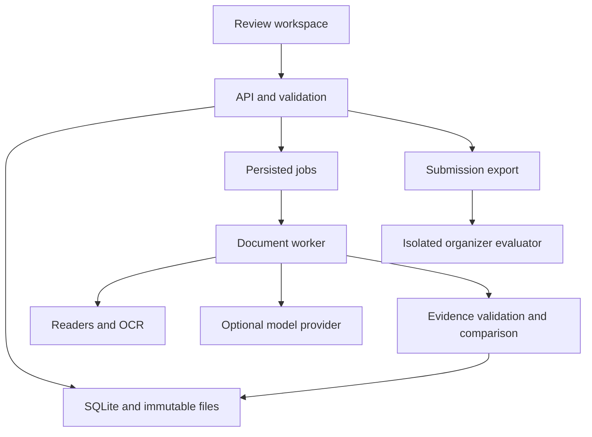

# ClearDraft: complete hackathon implementation blueprint

Version 1.0 | Prepared 20 September 2026 | Working product name: ClearDraft

Navigation: [Product and value](#1-product-thesis-and-business-value) · [Input audit](#2-verified-input-inventory-and-limitations) · [Architecture](#3-architecture-and-technology-decisions) · [Data contracts](#4-domain-model-and-contracts) · [Readers](#6-readers-and-source-evidence) · [Comparison rules](#7-field-extraction-and-normalization) · [Human review](#9-human-review-and-revisions) · [Screens and flows](#10-user-experience-and-eight-flows) · [API](#11-api-and-command-line-contract) · [Scoring](#12-submission-and-scoring) · [Tests](#13-baseline-challenge-lab-and-validation) · [Business measurement](#14-business-measurement-and-reporting) · [Release gates](#17-release-acceptance)

## 0. Execution contract

This document specifies a complete local hackathon application. The deliverable is working software, an evaluated verification pipeline, an operator interface, reproducible demonstrations, and a documented business case. This document is an implementation plan, not an assertion that the application or its performance already exists.

The two supplied ZIPs are sufficient inputs. No shipping-company integration, customer history, external operational dataset, or further organizer response is a prerequisite. An optional model credential enables the live AI provider. A usable local mode must work without credentials; it must expose its limitations rather than inventing outputs.

Read `START_HERE.md`, this document, `PROMPT_CONTRACTS.md`, and `BUSINESS_AND_DEMO.md`. Execute `BACKLOG.json` in dependency order and turn `ACCEPTANCE_TESTS.json` into executable tests. Use `SUBMISSION_SCHEMA.json` to validate exports. Treat `DATASET_AUDIT.json` as observations about the attached version, not prediction rules.

An implementation agent should make routine engineering decisions, record them, and continue. Stop only for inaccessible required inputs, credentials needed for an explicitly selected live operation, or a consequential action outside the build authorization. Do not stop at scaffolding, a mock UI, an architecture diagram, or a partially implemented happy path. Do not initiate deployments, purchases, or external messages merely because the application can prepare them.

The specification describes one engineering project; it does not require a multi-agent runtime. A straightforward pipeline is the default. Do not add autonomous agent delegation, a vector database, or an orchestration framework without a concrete demonstrated need.

## 1. Product thesis and business value

### 1.1 Problem

Shipping staff must identify document-comparison requests within a mixed inbox, find the SI and draft BL, align differently labeled fields, and catch discrepancies before the draft is finalized. A tool that produces an unreliable answer can leave the operator repeating the original comparison.

Build a review workspace that completes supported checks automatically and reduces unresolved cases to specific, evidence-backed questions. The target benefit is lower human effort per correctly completed comparison while maintaining error detection. Increased operational capacity is a hypothesis to measure; shipment-delay savings and financial loss avoidance cannot be established from these files alone.

### 1.2 Required differentiation

| Capability | Concrete implementation | Business value to test |
| --- | --- | --- |
| Inspectable evidence | Every resolved field links to the exact source passage or cell and records normalization | Less time locating and checking AI claims |
| Targeted human review | Ask about the unresolved value, role, or category; preserve unaffected findings | Less repeated review work |
| Revision checks | Recheck all seven fields on a new SI/BL pair and distinguish resolved, persistent, and new issues | Fewer errors introduced during correction |
| Live challenge mode | Change a reviewed copy, compute expected behavior, and run the real pipeline | Visible robustness beyond selected examples |
| Honest measurement | Compare a simple baseline with the proposed workflow on the same reviewed case set | A defendable capacity and quality argument |

All five are release requirements. None constitutes a guarantee of a winning submission or production reliability. The quality of implementation and the observed results are the evidence.

### 1.3 Scope boundaries

Include five-category classification; TXT, PDF, DOCX, XLSX ingestion; scanned-PDF OCR; seven-field extraction and comparison; evidence navigation; human review; visible recovery; revisions; local reports; exact submission export; optional organizer scoring; a live challenge lab; baseline comparison; startup and demo documentation.

Exclude live email ingestion, sending messages, booking changes, customs filing, shipment release, financial forecasts, carrier risk scoring, globally learned entity aliases, root-cause attribution, deadline optimization, and multi-tenant enterprise administration. Prepare editable correction/information-request drafts for copying or downloading only. A completed comparison is not approval to finalize a legal shipping document.

### 1.4 Personas

1. Operations reviewer: sees the inbox, resolves exceptions, examines evidence, and adds revised documents.
2. Operations lead: reviews completion, unresolved work, quality measurements, and measured effort.
3. Judge/developer: imports the supplied data, runs evaluation and live challenges, exports results, and inspects reproducibility.

For the local hackathon, these are workspace views, not claims of authenticated enterprise roles. Default network binding is loopback. A hosted version would require a separate authorization design.

## 2. Verified input inventory and limitations

### 2.1 Attached version

| Item | Observed value |
| --- | --- |
| Participant archive | `sdoc-hackathon-bundle(1).zip` |
| Evaluator archive | `sdoc-hackathon-docker.zip` |
| Email JSON records | 520 |
| Attachment files | 250 |
| Formats | 192 TXT, 28 PDF, 22 XLSX, 8 DOCX |
| Emails with zero / one / two attachments | 394 / 2 / 124 |
| Email keys | `email_id`, `from`, `subject`, `body`, `attachments` |
| Submission template | All 520 entries are default placeholders, not predictions |
| Public file equivalence | The 520 inbox files and 250 attachments match the Docker archive's public copies byte-for-byte |

Attachment absence alone does not determine category. Many non-comparison messages have no attachments; some comparison requests also have none. Do not infer labels from counts, record numbers, filename suffixes, documentation distributions, or sample-output defaults.

No dependable structured arrival timestamps, thread IDs, revision links, staffing records, fee tables, or handling-time history are provided. Local import timestamps must be labeled as such; never present them as email arrival times. User-uploaded revisions are linked explicitly to a selected case.

### 2.2 Input contracts

One email is an immutable imported record with the five supplied keys. Preserve the raw record and hash it. Validate `attachments` as relative paths, not executable input. Store missing paths as case issues rather than discarding the email. Keep import namespace plus original `email_id` as the unique identity; duplicate IDs with different content require a new import or an explicit conflict.

Support three participant input modes:

1. ZIP selected in the UI or supplied by CLI.
2. Extracted participant directory supplied by CLI.
3. Optional configured organizer HTTP source, using the supplied loader's public interface.

Detect the participant bundle by its `inbox/` and `attachments/` structure; its outer filename may vary. A Docker ZIP must never be accepted silently as participant input. The setup tool may prepare it separately for evaluator use.

### 2.3 Separate the evaluator

The Docker distribution contains `data_v2/ground_truth.json` and data-generation code. The application, prompts, inference code, frontend, and test fixture collection must not read the answer key or use generator internals to predict labels. The evaluator alone may load the answer key to compute aggregate scores. Do not enable or call its truth-reveal endpoint.

Mount only participant `inbox/`, `attachments/`, and the submission template into the application. Keep the Docker archive/extraction outside the application build context, search scope, prompts, and recursive dataset ingestion. Add explicit ignore rules and a regression test that the application container cannot read an evaluator-only canary. Do not bundle the answer key into release artifacts.

Reading the public scoring implementation to understand the contract is permitted. Do not change the evaluator to improve the application's score.

### 2.4 Benchmark inconsistencies to preserve visibly

The participant guide says missing attachments should trigger review. The Docker dataset README also states that some main-set requests without attachments carry an `OK` reference status. These conventions do not provide evidence that a comparison was completed.

The README groups image-only PDFs among review cases, while the product should attempt OCR. A successful, evidence-supported OCR comparison may disagree with that convention. Native text inspection of the attached version found image-only SI/BL PDFs in several cases and unreadable PDF streams in others; missing text does not prove that OCR will fail.

Default behavior: apply one content-based operational policy to every case. A requested check lacking its documents is `NEEDS_REVIEW`; successful OCR can lead to a completed comparison. Export those actual outcomes. Record known convention conflicts in `benchmark_notes.md`, without silently relabeling the case to chase a score. Do not create an ID-based compatibility mode.

The evaluator's reliability implementation is less strict than its prose: its counters primarily inspect `status`; its per-reason counters group by reference reason rather than proving the submitted reason is correct. It does not fully assess source evidence, review usefulness, mixed outcomes, or work saved. Therefore validate category and reason correctness independently on reviewed examples. Never exploit weak validation.

## 3. Architecture and technology decisions

### 3.1 Default stack

| Layer | Default | Rationale |
| --- | --- | --- |
| UI | React, TypeScript, Vite | Responsive review workspace with typed API client |
| UI components | Accessible headless primitives and a small design system | Keyboard interactions, dialogs, tables, and consistent states |
| API | Python, FastAPI, Pydantic | Shared typed contracts and convenient parsing ecosystem |
| Persistence | SQLite on a local volume, SQLAlchemy, Alembic | Reproducible single-machine setup and explicit migrations |
| Worker | Separate Python process using persisted jobs | Survives page refresh and recovers from process restarts |
| PDF | PyMuPDF for text, geometry, and page rendering | Traceable passages and source previews |
| OCR | Tesseract via an adapter | Local recovery for image-only pages |
| DOCX | python-docx, with bounded OOXML inspection where needed | Paragraph and table extraction |
| XLSX | openpyxl | Worksheet/cell provenance and formula visibility |
| AI | Provider adapter with configurable model ID | Live structured extraction without locking business logic to one model |
| Tests | pytest, frontend component tests, Playwright | Contract, pipeline, and browser acceptance checks |
| Packaging | Docker Compose plus documented native setup | Portable judge startup |

Resolve compatible stable versions in the build environment, lock them, and record actual versions. Do not use floating `latest` image tags in the final release. Avoid requiring a GPU. Model IDs and token prices are configuration, not guessed constants. Record relevant dependency licenses in the final dependency inventory.

PDF word positions can be extracted using PyMuPDF's text APIs; retain them rather than asking a model to invent coordinates. [PyMuPDF text documentation](https://pymupdf.readthedocs.io/en/latest/recipes-text.html)

PyMuPDF's integrated OCR relies on Tesseract; install its executable and language data and retain the OCR text page for subsequent extraction. Detect availability at startup. [PyMuPDF OCR documentation](https://pymupdf.readthedocs.io/en/latest/recipes-ocr.html)

### 3.2 Runtime topology



Use a DB-backed job table with atomic claiming, attempts, lease expiry, heartbeat, cancellation intent, and bounded retries. Initial concurrency is one worker and at most two simultaneous provider calls. Configure SQLite WAL and a busy timeout; hold write transactions briefly and never while waiting on OCR or model calls. API and worker share one local persistent volume. This is a single-host deployment, not a distributed cluster.

Polling run status every one or two seconds is sufficient. SSE is optional. FastAPI documents in-process background tasks, but heavy work should be separated from request handling; the persisted-worker design is this project's decision for restart recovery. [FastAPI background-task documentation](https://fastapi.tiangolo.com/tutorial/background-tasks/)

### 3.3 Suggested repository layout

| Path | Ownership |
| --- | --- |
| `apps/api/` | Routes, Pydantic schemas, database models, migrations |
| `apps/worker/` | Job loop, stages, retry handling |
| `apps/web/` | UI, typed client, component and browser tests |
| `packages/core/` | Classification, normalization, comparison, state policies |
| `packages/readers/` | TXT/PDF/OCR/DOCX/XLSX adapters and evidence locators |
| `packages/providers/` | Live AI, conservative local rules, and recorded replay adapters |
| `packages/evaluation/` | Baseline, metrics, variant generation, exports |
| `contracts/` | JSON schemas, generated API schema, shared enumerations |
| `tests/fixtures/` | Small reviewed fixtures and explicitly synthetic variants |
| `scripts/` | Safe import, startup doctor, benchmark, release validation |
| `src/cleardraft/` | Installable CLI entry point used by the documented `python -m cleardraft` commands |
| `docs/` | Setup, architecture, decisions, benchmark notes, demo, measured results |
| `var/` | Ignored local DB, source blobs, previews, job artifacts |
| `infra/evaluator/` | Ignored evaluator extraction; never mounted into the app |

Do not copy whole source archives into the application image. Keep the source tree, test data, runtime data, and evaluation-only files distinct.

## 4. Domain model and contracts

### 4.1 Exact fields and categories

Categories: `BL_COMPARISON`, `SI_REQUEST`, `INVOICE_QUERY`, `GENERAL`, `SPAM`.

Required comparison fields: `shipper`, `consignee`, `notify_party`, `port_of_loading`, `port_of_discharge`, `container_count`, `gross_weight_kg`.

Document roles: `SI`, `DRAFT_BL`, `OTHER`, `UNKNOWN`. Preserve the identified actual document type, such as invoice, separately. A filename ending in `_BL` is a weak hint, never authority.

### 4.2 Separate three kinds of state

| Dimension | Values |
| --- | --- |
| Processing | `QUEUED`, `RUNNING`, `SUCCEEDED`, `FAILED`, `CANCELLED` |
| Verification | `NOT_APPLICABLE`, `NOT_STARTED`, `MATCH`, `MISMATCH`, `NEEDS_REVIEW` |
| Operational case | `OPEN`, `AWAITING_INFORMATION`, `AWAITING_REVISION`, `COMPLETED` |

A case may have `verification=NEEDS_REVIEW` and two confirmed mismatched fields. Never erase those mismatches. A successfully executed parser that finds a missing value has `processing=SUCCEEDED`, not `FAILED`. An API timeout is a processing failure, not a fabricated unreadable source document.

### 4.3 Persistence entities

| Entity | Required attributes and constraints |
| --- | --- |
| `imports` | UUID, source mode, manifest hash, import timestamp, raw-file counts, validation issues |
| `emails` | Import ID, original email ID, immutable raw JSON, content hash; unique pair of import ID and email ID |
| `cases` | Email FK, current category, classification review state, operational state, current pair ID, optimistic version |
| `documents` | Immutable UUID, SHA-256, bytes path, size, detected format, original filename, source import, origin kind |
| `document_versions` | Case ID, document ID, declared/identified role, replaces-version ID, created timestamp; bytes remain immutable |
| `comparison_pairs` | Case ID, selected SI version, selected BL version, selection origin, case version |
| `evidence_blocks` | Document version, extraction version, locator, raw text, text hash, optional geometry |
| `runs` | UUID, import/case scope, mode, immutable input hashes, pair ID, pipeline/model/prompt/policy versions, parent run, stage and timings |
| `field_results` | Run, field, SI/BL observation IDs, typed canonical values, result, reasons, normalization records; unique run/field |
| `observations` | Field, raw value, evidence references, extraction method, value status, role, optional quality signals |
| `review_tasks` | Case/pair/run, issue type, exact question, source references, status, assigned local reviewer label, expected case version |
| `review_events` | Append-only user decision, reason, old/new reading, evidence, case version, timestamp, supersedes-event ID |
| `jobs` | Type, input references, status, attempts, next attempt time, lease owner/expiry, heartbeat, error code, idempotency key |
| `drafts` | Case/run, draft kind, generated text, edited text, version, referenced findings; no sent state |
| `challenges` | Base fixture hash, transformation, seed, expected effect, mutated source hash, isolated run, outcome |
| `measurements` | Run/test session, machine or human event, elapsed/active time, cost/token usage, mode, participant pseudonym where applicable |
| `exports` | Frozen run selection, schema/policy version, bytes hash, completeness, machine-only or human-assisted label |

Store decimals as decimal strings or exact scaled values, never binary floating point for weight comparison. Keep UTC timestamps with offsets. Do not expose physical server paths in UI links or API responses.

### 4.4 Observation and evidence example

The following is illustrative and contains no measured model output:

```json
{
  "field": "gross_weight_kg",
  "document_version_id": "docv-example-si",
  "value_status": "PRESENT",
  "raw_value": "21,577 KG",
  "canonical_value": "21577",
  "canonical_unit": "kg",
  "extraction_method": "native_text",
  "evidence": [
    {
      "block_id": "block-example",
      "quote": "Gross Weight (KG): 21,577 KG",
      "locator": {"kind": "text_lines", "start_line": 14, "end_line": 14}
    }
  ],
  "normalizations": ["remove_group_separator", "explicit_kg_unit"],
  "validation": {"evidence_exists": true, "value_supported": true, "ambiguous": false}
}
```

Example line numbers are illustrative; runtime locators must be generated from actual parsing. `value_status` is one of `PRESENT`, `MISSING`, `AMBIGUOUS`, `UNREADABLE`, `NOT_EXTRACTED`. A field result is `MATCH`, `MISMATCH`, or `UNRESOLVED`. Null is not zero and not a matching empty string.

### 4.5 Case result aggregation

```text
if category is not BL_COMPARISON:
    verification = NOT_APPLICABLE
elif processing failed or category/document pairing remains unresolved:
    verification = NEEDS_REVIEW
elif any required field is UNRESOLVED or a required document is absent/invalid:
    verification = NEEDS_REVIEW
elif any required field is MISMATCH:
    verification = MISMATCH
else:
    require exactly seven evidence-supported MATCH results
    verification = MATCH
```

Store `confirmed_mismatch_fields` and `unresolved_fields` independently. The UI may show “2 differences; 1 field unresolved.” A correction draft may include confirmed differences and a separate request for missing evidence. It must not state that the comparison is complete.

## 5. Ingestion, classification, and pairing

### 5.1 Import sequence

1. Validate archive shape, size, entry count, and paths before extraction.
2. Reject absolute paths, traversal, symbolic links, nested archives outside supported file formats, and entries resolving outside the import root. Use path containment, not a string-prefix check.
3. Initial configurable limits: 10,000 entries, 100 MiB uncompressed per import, 20 MiB per attachment, and 100 pages per document. Fail visibly when exceeded; do not silently truncate.
4. Read and validate email JSON; verify each referenced attachment independently.
5. Hash original bytes, create immutable blobs, and build an import manifest.
6. Import valid records even when an attachment is missing; record that issue.
7. Show counts of accepted records, malformed records, and attachment problems. The attached valid bundle should yield 520 emails and 250 stored attachments.
8. On identical repeated import, reuse the manifest or create a linked import explicitly; do not duplicate active jobs unknowingly.

### 5.2 Classification

Use subject plus current email body as primary evidence. Retain the full quoted thread, but separate it from the current request where possible. An external-sender warning or signature is not user intent. A document comparison can be requested without attachments. A subject containing “REQUEST BL DRAFT” may still accompany a genuine attached comparison request; read the body.

Ask the provider for a category, current-request evidence span, request subtype, and ambiguity indicators. Subtypes may include `COMPARE_ATTACHED`, `REQUEST_DRAFT_FOR_CHECKING`, and `UNCLEAR`, but do not alter the five organizer categories. Rules can classify strong explicit requests; do not use sender identity or attachment count as a categorical shortcut.

If ambiguous, open a category review task. Use a provisional valid category for frozen machine exports only when a deterministic documented selection is required, and list such cases as unresolved classification in the companion report. Do not advertise them as verified comparisons or hide uncertain classification behind `GENERAL`.

The local rules provider must return conservative decisions with traceable reasons. Compare its measured behavior with live AI mode. Never label local rules as a live model.

### 5.3 Document identification and pairing

Inspect document content and layout for role. Allow the model to identify roles using source passages, then validate against explicit document headings and fields. A Commercial Invoice named `*_BL.txt` remains `OTHER`.

For the supplied pairs, reference numbers can conflict even when the intended SI/BL pairing is specified by the email. The seven comparison fields are authoritative for this challenge. A differing BL number and booking reference are not automatically a failed pair; these identifiers can be different kinds. Record context anomalies without adding unrequested mismatch fields.

When exactly one usable SI and one usable draft BL occur in the email, select them with recorded provenance unless there is strong contradictory shipment evidence. When there are multiple plausible versions, present a role/pair selection task. Compare only the selected pair. Never match documents globally based on company name alone.

## 6. Readers and source evidence

Every reader returns `DocumentReadResult`: document hash; detected format; ordered text/table blocks; source locators; optional page previews and geometry; parser version; warnings; and read failure details. It does not return final comparison results.

### 6.1 TXT

Decode UTF-8 with explicit handling of encoding errors. Keep original bytes and line offsets. Detect replacement characters and excessive control characters. Read multi-line party blocks until a credible next label. Support synonyms using a versioned field-label map. Preserve full raw party blocks as evidence even if canonical comparison focuses on the named organization.

### 6.2 PDF and OCR

Extract native text blocks and word coordinates page by page. Preserve page dimensions and rotation. Identify table rows separately when possible; keep enough context to avoid mixing adjacent columns. Render page previews locally at a controlled resolution and map evidence boxes into the displayed coordinate system.

When a page has insufficient usable text, render and OCR only the necessary page(s). Record the OCR engine, language configuration, and whether each passage came from OCR. No text layer does not mean unreadable. A garbled file, OCR failure, or ambiguous recovered value must remain unresolved. Do not run two AI extractors blindly and treat agreement as independent proof.

Geometry must come from a parser or OCR engine. If a vision model supplies a value without a verifiable location, show it as a candidate requiring confirmation. A missing coordinate may use a correct page/block reference with an honest fallback; never draw a fabricated highlight.

### 6.3 DOCX

Read body paragraphs, tables in document order, and relevant headers/footers. Preserve paragraph indices, table/row/cell coordinates, merged-cell context, and bilingual labels. If important text is stored in unsupported shapes/text boxes, use bounded OOXML extraction or a documented conversion fallback. Report unsupported content. Word pages are not stable unless rendered; use paragraph/table locators rather than invented page numbers.

Use a structured source view with visible table cells in the first release. Optional PDF conversion is a later convenience, not a dependency for source evidence.

### 6.4 XLSX

Retain worksheet names, cell addresses, merged ranges, raw values, displayed number formats, formula text, and cached values when present. Read formulas and cached values using separate workbook views. The library does not supply a calculation engine; a formula with no usable cached value is unresolved unless an explicitly implemented safe calculation covers it. Do not execute macros or external links.

Distinguish visible content, hidden sheets/rows, totals, container descriptions, and package counts. Do not silently concatenate the entire workbook into a string. For a merged cell, use the anchor value with the full merged range as evidence. [openpyxl tutorial](https://openpyxl.readthedocs.io/en/stable/tutorial.html)

### 6.5 Evidence validation

For every extracted candidate verify: document version exists; block ID belongs to that document; quote matches the block under limited whitespace normalization; locator is within bounds; extracted value is supported by that quote or a recorded numeric conversion; and no conflicting candidate was suppressed.

Evidence validation proves source linkage, not semantic correctness. The UI must expose the passage so a person can detect a field misinterpretation. An unsupported model quote is rejected and may trigger one bounded retry; it is never accepted because the model reports high confidence.

## 7. Field extraction and normalization

Extract each document independently before comparing. Do not show the SI to the BL extractor or vice versa. This reduces the opportunity to fill a missing field from the other document. Use deterministic parsing where labels and values are clear and structured AI extraction for the remaining blocks. Provider output must validate against the strict schema in `PROMPT_CONTRACTS.md`.

| Field | Rules |
| --- | --- |
| Shipper, consignee, notify party | Keep raw entity/address block; normalize Unicode, case, and whitespace conservatively; compare explicit named organizations. Preserve legal-name tokens and qualifiers. Do not merge entities by fuzzy similarity alone. |
| Ports | Parse port name, country, terminal, and explicit code separately. Use code agreement only when no conflicting name/country/terminal remains. Use a small reviewed alias map if needed; never hallucinate a global port dictionary. |
| Container count | Integer number of containers; `6 x 40'HC` means six, not forty. Package/pallet count is a different measure. Sum explicit container-type quantities only when their grouping is unambiguous. |
| Gross weight | Exact decimal in kilograms; explicit metric tonnes multiply by 1,000. Preserve unit evidence. Gross, net, and tare are distinct. Missing/ambiguous units require review. |

### 7.1 Important boundaries

1. Labels are mapped by meaning; values are not normalized into agreement merely because their labels are synonyms.
2. `N/A`, `TBA`, `???`, underscore blanks, and empty cells are absent/unknown values, not literal names to compare or zeros.
3. Whitespace and case differences can be harmless. Changing an organization token, numeric quantity, country, or conflicting code cannot be discarded as formatting.
4. Corporate suffix abbreviations are only equivalent under an explicit reviewed mapping. Avoid broadly deleting `LTD`, `LLC`, or similar terms.
5. Address-only differences are recorded as context. This seven-field challenge compares party identity; where address changes make identity ambiguous, require review rather than silently accepting or adding an eighth defect field.
6. “Same as consignee” can resolve only to a present, unambiguous consignee in the same document, with both pieces of evidence attached. It cannot refer to the other document.
7. Numeric grouping/decimal conventions need context. A value such as `1,234` without reliable convention cannot always be interpreted as either 1234 or 1.234. Record the chosen rule or abstain.
8. Compare exact normalized weights by default. Do not invent a business tolerance. Any configurable tolerance must default to zero, be prominently recorded, and be excluded from organizer results unless explicitly allowed.
9. Differing values with reliable evidence are `MISMATCH`. Missing, conflicting, or unreadable evidence is `UNRESOLVED`.
10. Do not use SI values, email assertions, or historical guesses to repair missing BL data, or the reverse.

## 8. Provider policy and processing escalation

### 8.1 Modes

| Mode | Behavior | Required UI label |
| --- | --- | --- |
| `local_rules` | Parsers, label rules, deterministic comparison, conservative abstention; OCR if installed | Local processing |
| `live_ai` | Configured provider for classification and unresolved extraction; same validators/comparator | Live AI |
| `replay` | Recorded results from a real prior run with input/model/policy hashes | Recorded replay |

Replay is a demo fallback and regression fixture, not a live accuracy run. It must reject changed input hashes or explicitly rerun them through a real provider. A judge's mutation must never receive a cached original answer. Local mode must process supported fixtures and produce genuine review tasks for unsupported cases, rather than returning a hardcoded showcase.

### 8.2 Provider adapter

Define `classify_email`, `identify_document`, and `extract_fields` operations with typed input/output contracts, timeout, cancellation, input hash, model ID, prompt version, usage, and error reporting. Keep API keys in server environment variables only. Use a provider-supported structured-output mechanism where available and still validate locally. Do not select or advertise a particular current model until credentials and availability are verified in the target environment.

Default limits: at most two extraction attempts per unresolved document stage, one schema-repair attempt within that budget, bounded exponential backoff for temporary failures, and a configurable global run budget. A rate limit or budget exhaustion moves the job into a visible recoverable state; it does not transform an unknown field into a match.

### 8.3 Escalation ladder

1. Native parser and explicit field rules.
2. AI extraction on selected source blocks when useful.
3. OCR for pages lacking usable text, followed by evidence validation and extraction.
4. One targeted reread/alternative parse where evidence suggests recovery is possible.
5. A field-specific review task, or a request for missing source material.

Do not re-OCR a known corrupt file indefinitely. Cache reading by content hash plus parser/OCR settings and version. Cache extraction by document hash, prompt, model, and normalization policy. A different document pair may reuse document reads but must receive its own comparison result.

### 8.4 Reliability policy

Use explicit quality gates: evidence present; role established; value parse valid; candidates unambiguous; no unresolved required fields. Model confidence is diagnostic only. A self-reported 99% is not a clearance rule. If later adding a calibrated selection score, train/tune it on the development set and report its coverage/error trade-off on a held-out set. Do not claim statistical guarantees from a small hackathon sample.

## 9. Human review and revisions

### 9.1 Review-task types

| Type | User action | Effect |
| --- | --- | --- |
| Category ambiguity | Select category with source email context | Re-route and record decision |
| Role/pair ambiguity | Select SI and BL among candidates | Create selected pair and run checks |
| Uncertain reading | Confirm or correct the transcription against a cited source | New assisted run for affected results |
| Missing value | Upload supporting or corrected source material | New source/version, then compare |
| Unreadable document | Upload clearer source or request recovery | New read attempt or version |
| Confirmed discrepancy | Confirm finding, correct mistaken extraction, or prepare draft | Keep evidence and appropriate open case state |

A reviewer may correct a transcription; they may not invent missing source truth and mark it machine-verified. If a business user supplies a value manually, retain it as an explicitly user-supplied assertion with its source/authority and require a corrected source before calling the SI/BL comparison complete in the default policy.

### 9.2 Review transaction

Client sends `expected_case_version`, `base_run_id`, task ID, action, evidence references, and optional corrected reading/reason. Server validates freshness and evidence, writes an append-only event, creates a new assisted run, and updates the active case atomically. Return HTTP 409 for stale review. The UI reloads and explains that the document pair changed; it never silently overwrites newer work.

Preserve the original machine-only run. Review events do not retroactively improve machine-only metrics. If a transcription correction changes a field used by another field, such as a consignee referenced by “same as consignee,” recompute its dependency closure. Unaffected evidence-backed fields in the same document versions can be reused.

### 9.3 Revision policy

A new SI or BL version creates a new selected pair. Re-run all seven comparisons; cached reads of an unchanged document may be reused. Previous human decisions are scoped to their prior source versions and must not silently carry into a changed source. Show:

- Resolved previous mismatches.
- Remaining mismatches.
- Newly introduced mismatches.
- Newly unresolved fields.

Keep the original documents and findings accessible. Repeated filenames do not identify repeated content; SHA-256 and immutable version IDs do. Source imports never get overwritten by a demo mutation or a correction upload.

### 9.4 Drafts

Generate correction and missing-information drafts from validated findings. Include case reference, exact relevant values, and the missing material or requested correction. Never add invented names, shipping promises, dates, or fees. Keep text editable. Provide Copy and Download; no email connector or Send button is required. Source finding changes mark an existing draft as stale until regenerated or reviewed.

## 10. User experience and eight flows

### 10.1 Navigation and routes

| Route | Screen |
| --- | --- |
| `/imports` | Import/setup and run history |
| `/inbox` | Categorized inbox and case queue |
| `/cases/:id` | Seven-field comparison and evidence workspace |
| `/cases/:id/history` | Versions, runs, review decisions, revision comparison |
| `/challenges` | Live challenge setup and outcomes |
| `/evaluation` | Organizer score, baseline comparison, measured quality and effort |
| `/settings` | Processing mode, model configuration status, limits, readiness checks |

Use one app shell and consistent status language. The default landing page after import is the inbox with current run status. Do not make a chatbot the main navigation. No data means an import action and explanation, not invented dashboards.

### 10.2 Inbox and queue

Show email identifier, subject, category, comparison state, count of confirmed differences, unresolved fields, and next action. Keep processing failures visible. Provide category/status filters and search across identifier/subject. Label import time accurately. A clean verification, a classified non-comparison email, and an unprocessed message must look different.

Summary counts must reconcile to the selected import. Clicking a count filters the same underlying rows. Paginate/virtualize if needed; do not load hundreds of full documents into the browser at once. A batch run remains visible after refresh.

### 10.3 Case workspace

Desktop: field summary panel plus SI and BL source panels. Clicking a field scrolls both source panels to the evidence. At narrower widths, stack source panels with explicit SI/BL labels and keep the field selector visible. The seven rows show raw and normalized values, status, evidence controls, and normalization details on demand.

Prioritize unresolved and mismatched fields without hiding matches. An uncertainty review displays one specific question, source context, candidate reading when available, and Confirm / Correct reading / Cannot read actions. Missing-value review displays Request source / Add document rather than a guessed autofill.

Keep a persistent indication of machine-only versus human-assisted results and current document versions. Show confirmed differences alongside unresolved fields. Use text and icons as well as color. Avoid percent confidence badges unless calibrated and explained.

### 10.4 Flow specifications

| Flow | Entry | User action | System behavior | Outcome |
| --- | --- | --- | --- | --- |
| F1 Import and route | Supplied ZIP/directory | Import and start run; clarify uncertain category if needed | Validate inputs, classify current request, route comparison cases | Classified-only or a document case |
| F2 Matching comparison | Valid SI/BL pair | Optional evidence inspection | Verify all seven with source support | No mismatch detected; comparison complete |
| F3 Discrepancy review | Confirmed different values | Inspect passages; confirm or correct extraction; prepare draft | Retain finding and request revision where appropriate | Open confirmed mismatch or corrected result |
| F4 One uncertain field | A source reading remains ambiguous | Confirm/correct against source, or choose Cannot read | Recompute affected field dependencies; preserve unchanged checks | Resolved field or specific source request |
| F5 Missing information | Missing attachment/value or wrong document | Review draft and upload source when obtained | Keep case open, validate source, resume checks | Awaiting information or new comparison |
| F6 Revision | New SI/BL attached to existing case | Select pair and inspect changed findings | Recheck seven fields and diff outcomes | Completed or remaining/new issues |
| F7 Failure recovery | Parsing/provider/job failure | Retry appropriate stage or upload replacement | Preserve history, run bounded retry, show honest failure | Recovery or visible review requirement |
| F8 Challenge | Reviewed base fixture | Select mutation and run | Generate a copy, show expected effect, use real pipeline | Observable pass/failure with evidence |

### 10.5 Visual and interaction quality

Use a restrained professional interface: clear typography, consistent spacing, readable tables, neutral surfaces, and limited status colors. Avoid decorative graphs and fake financial KPIs. Provide loading, empty, success, stale, invalid-input, partial-result, and failure states for every major screen. Essential controls must work using keyboard navigation; dialogs need focus management; status updates need accessible announcements.

Validate at 1440px, 1024px, and a mobile width around 390px. Source text must remain selectable and copyable. Large tables may use an explicitly labeled horizontal scroll region. No controls should suggest unavailable functionality. Screenshots in the release must come from the working app.

## 11. API and command-line contract

### 11.1 API routes

All application routes are under `/api/v1`. Return typed JSON errors `{code,message,details,retryable,request_id}` without stack traces or secrets. Mutating requests use an idempotency key where duplicate actions matter. List endpoints use bounded pagination.

| Method / path | Request | Response / behavior |
| --- | --- | --- |
| `GET /health` | None | Liveness only |
| `GET /readiness` | None | DB, worker heartbeat, OCR/provider configuration; no secrets |
| `POST /imports` | Multipart participant ZIP | 202, import/job IDs; import errors available by ID |
| `GET /imports/{id}` | None | Counts, manifest hash, status, issues |
| `POST /imports/{id}/runs` | Mode, pipeline settings, scope | 202, run ID |
| `GET /runs/{id}` | None | Stage counts, progress, failures, immutable provenance |
| `POST /runs/{id}/cancel` | Expected run state | Cancellation request; completed work retained |
| `GET /cases` | Import, category/status filters, cursor | Case summaries |
| `GET /cases/{id}` | None | Category, pair, seven fields, issues, available actions |
| `GET /documents/{id}/source` | None | Allowlisted content type; immutable original download |
| `GET /documents/{id}/preview` | Page or structured-view selector | Safe page image or structured blocks |
| `GET /evidence/{id}` | None | Verified locator, quote, document version |
| `POST /cases/{id}/reviews` | Versioned review transaction | Review event and new assisted run |
| `POST /cases/{id}/documents` | New source, role hint, expected version | Immutable version and new pair/run |
| `POST /cases/{id}/pair` | SI/BL version IDs, expected version | Selected pair and run |
| `POST /cases/{id}/retry` | Failed stage/run reference | New job; bounded retry policy |
| `POST /cases/{id}/drafts` | Finding run, draft type | Editable local draft |
| `PATCH /drafts/{id}` | Text, expected draft version | Updated draft; no transmission |
| `POST /challenges` | Reviewed fixture, mutation, seed | Isolated challenge with expected outcome |
| `POST /challenges/{id}/run` | Provider/mode | Real challenge run |
| `GET /challenges/{id}` | None | Before/after, expected/actual, errors, evidence |
| `POST /exports` | Frozen run/import, assistance policy | Export ID; reject incomplete/unrepresentable results |
| `GET /exports/{id}/download` | None | Submission JSON or companion report |
| `POST /evaluations` | Export ID, configured evaluator name | Aggregate result stored against exact export hash |
| `GET /metrics` | Scope and assistance mode | Counts, denominators, measured latencies/usage |

Do not accept arbitrary filesystem paths or scoring URLs from a browser request. Directory import is a CLI/admin configuration capability. Optional remote input/evaluator hosts are configured explicitly; do not fetch arbitrary attachment URLs embedded in emails.

### 11.2 CLI acceptance contract

The agent must implement these commands or documented equivalents with the same behavior:

```bash
python -m cleardraft doctor
python -m cleardraft import --participant-zip ./inputs/participant.zip
python -m cleardraft run --import-id IMPORT_ID --mode local_rules
python -m cleardraft run --import-id IMPORT_ID --mode live_ai
python -m cleardraft export --run-id RUN_ID --machine-only --out ./artifacts/submission.json
python -m cleardraft evaluate --submission ./artifacts/submission.json --evaluator organizer
python -m cleardraft challenge --fixture FIXTURE_ID --mutation container-count-plus-one --seed 42
python -m cleardraft report --run-id RUN_ID --out ./artifacts/run-report.json
```

Commands return nonzero on validation failure, missing credentials for selected live mode, incomplete exports, or failed execution. A batch with valid unresolved cases can finish successfully and export those honest results; infrastructure failures must not disappear into that category without explicit mapping.

## 12. Submission and scoring

### 12.1 Required output

One top-level object keyed by every original email ID. Each entry contains exactly `category`, `status`, `review_reason`, `has_defect`, and `defect_fields` in the release export. Export deterministic ordering for review and hashing. Validate unique known IDs, all required IDs present, no extras, valid enumerations, and cross-field consistency.

```json
{
  "email_example": {
    "category": "BL_COMPARISON",
    "status": "MISMATCH",
    "review_reason": null,
    "has_defect": true,
    "defect_fields": ["consignee", "notify_party"]
  }
}
```

The example uses a placeholder ID and is not a valid full submission.

### 12.2 Projection policy

| Internal result | Submission projection |
| --- | --- |
| Classified non-comparison | Category; `OK`; null reason; false defect; empty fields. UI still says classification complete, not verified. |
| Seven verified matches | `BL_COMPARISON`, `OK`, null, false, empty fields |
| Complete comparison with differences | `BL_COMPARISON`, `MISMATCH`, null, true, exact differing fields |
| Incomplete comparison | `BL_COMPARISON`, `NEEDS_REVIEW`, supported reason, false, empty fields |
| Differences plus unresolved fields | Same incomplete projection; full report preserves confirmed differences and unresolved fields |
| Pending work or unmapped infrastructure issue | Block complete export; offer explicitly partial diagnostic report |

Allowed organizer reasons: `wrong_doc_type`, `missing_attachment`, `unreadable`, `missing_value`. Internally retain multiple specific issues. Choose a primary reason by the closest actionable blocker: physically absent referenced/source attachment first; a supplied supposed SI/BL that is demonstrably another document type second; existing source unreadable/ambiguous reading third; missing required content fourth. If the supplied supposed BL is an invoice, select `wrong_doc_type`, rather than treating its rejected role as an absent physical file. Where ambiguity does not fit the four reasons, require review or flag an unrepresentable export; do not invent a false reason.

Classification uncertainty also lacks an organizer status. Export the recorded provisional category only with a companion unresolved-classification disclosure; do not invent a sixth category. Freeze whether a run is machine-only or human-assisted before exporting and score the two separately.

### 12.3 Scoring interpretation

The supplied code weights category macro-F1 at 30%, email-level defect F1 at 20%, and end-to-end exact defect-field success at 50%. It also reports field F1, exact field-set match, and escalation metrics. End-to-end success requires correct comparison routing, a defect flag, and the exact defect-field set. Adding extra fields can lose that success.

Reliability is diagnostic and is not included in the weighted headline. Some status inconsistencies are not fully checked by the scorer. Run strict local validation and operational tests regardless of score. Do not repeatedly probe individual predictions against the evaluator to reconstruct the answer key.

Store the export hash, evaluator version/hash, timestamp, score response, policy versions, and known benchmark-convention notes. A score from one export must never be displayed beside changed results as though current.

## 13. Baseline, challenge lab, and validation

### 13.1 Baseline

Implement a simple comparison baseline using the same available source extraction and, in AI mode, the same model with a direct classification/comparison prompt. It returns category/status/fields without targeted review and evidence navigation. This allows a fair comparison of workflow and verification choices. Keep provider, document set, and budget differences visible. A local-rule baseline is also useful but cannot substitute silently for an AI baseline.

Do not intentionally cripple the baseline. Give both approaches the same accessible document content and record costs. Evaluate machine output before any reviewer corrections. A separate human-effort trial compares people doing the same kinds of tasks with each interface.

### 13.2 Reviewed evaluation set

The coding agent should prepare a small source-reviewed manifest covering all formats, categories, clean and mismatched pairs, missing inputs, wrong types, and scanned/corrupt documents. Suggested initial size: 40-60 original emails, adjusted to include meaningful coverage. Have a human verify the labels where possible; otherwise label them as developer-reviewed and do not claim independent expert ground truth.

Split original cases into development and held-out evaluation groups before tuning. Cluster byte duplicates and near-duplicate templates conservatively; every mutation of an original stays in the same group. Never use the private evaluator answer key to construct this manifest. Preserve disputed labels with reasons. Run full-bundle organizer evaluation separately.

### 13.3 Challenge transformations

| Transformation | Preconditions | Expected relationship |
| --- | --- | --- |
| Case/spacing variation | Reviewed field with a defined harmless normalization | Same category and field result |
| Attachment rename | Contents unchanged, references updated | Same role identification and result |
| Label synonym substitution | Reviewed supported synonym | Same canonical field and result |
| Container count change | Unambiguous count in one BL source | Only that field changes according to the known base result |
| Remove SI required value | Known present value in reviewed base | That field becomes unresolved; never auto-clear |
| Wrong document type | Replace BL with a clearly labeled invoice copy | Review for wrong type, not guessed comparison |
| Misleading email assertion | Add a claim of correctness, keeping comparison intent and documents | Documents still determine discrepancies |
| PDF scan transformation | Legible reviewed source rendered into image PDF | Correct recovery or explicit uncertainty; never false clearance |
| Correct two names, introduce a count error | Known two-name mismatch base | Old name issues resolve; new count mismatch appears |

Mutation code must create actual changed bytes, retain a diff/provenance manifest, and verify transformation preconditions. Never change only a displayed label or expected JSON. Initially support exact text transformations and image-PDF generation; broader DOCX/XLSX mutations are stretch work. A failed precondition means the challenge is unavailable for that fixture.

Show base source, chosen mutation, expected effect, actual result, and evidence. An OCR recovery challenge may have an allowed safe-abstention outcome distinct from successful recovery; report them separately. Do not count all abstentions as successful extraction. A precise harmless-formatting challenge should require invariant behavior to pass its usability objective.

### 13.4 Required test layers

1. Unit tests for normalization, unsupported values, party references, state aggregation, and export projection.
2. Reader tests with genuine text, PDF, scanned PDF, DOCX, and XLSX fixtures; cover multiline/merged structures.
3. Contract tests for provider output, evidence references, API review transactions, and submission schema.
4. Integration tests through import, worker, DB, run results, review, revisions, and exports.
5. Failure tests for model timeout, corrupt sources, OCR unavailable, budget exhaustion, worker termination, stale reviewer state, and duplicate import.
6. Browser tests for the eight user flows, actual evidence navigation, editable draft, revision changes, challenge execution, and empty/error states.
7. Evaluation tests proving machine and assisted runs, original and mutated cases, and live and replay modes remain separate.

Test behavior and invariants, not implementation trivia. Stop adding tests once the defined risks and release gates are covered; prioritize completing the application.

## 14. Business measurement and reporting

The source bundle cannot prove actual shipment savings. It can support measured document-checking quality, run cost, and a small human-review study.

Required report fields:

- Import size and categorized counts, with processing completeness.
- Classification quality on the reviewed subset and organizer metrics on the full submitted bundle.
- Machine-only comparison coverage: evidence-supported completed comparisons divided by independently labeled comparison requests; separately report the subset with usable documents.
- Incorrect clearance counts: cases reported as seven-field matches that contain a confirmed discrepancy or unresolved required input. Show denominator of auto-cleared cases and absolute counts.
- Discrepancy precision/recall and field-level exactness.
- Human review frequency, unresolved fields per case, and active review time where actually measured.
- Native parsing, OCR, provider, and total runtime distributions; include failures and timeouts.
- Token usage, calls, and configured cost estimates with currency/rate source/date; unknown costs remain unknown.
- Challenge results broken down by mutation and format; do not pool variants as independent shipment evidence.

Report “0 observed false clearances across N reviewed auto-cleared cases,” not “100% safe.” A small sample cannot prove zero production risk. Completion coverage is not business accuracy; a wrong automated answer is not saved work.

Human-effort measurement needs real people performing tasks. Instrument browser-visible active sessions, pause on tab hiding, and allow idle-time correction; record the method. Balance task order and use matched case groups to reduce learning effects. If no participants are available, deliver the instrumented trial and label measured business benefit as pending. Do not fabricate timing results.

Reclaimed hours = observed case volume multiplied by measured minutes saved per comparable case divided by 60. Annualization requires user-supplied real volume and an explicitly stated representativeness assumption. A hypothetical calculator must label every assumption. No automatic conversion of all reclaimed time into cash savings.

See `BUSINESS_AND_DEMO.md` for the study protocol and pitch structure.

## 15. Deployment, resilience, and data handling

### 15.1 Reproducible launch

Default Compose services: `web`, `api`, `worker`; optional `organizer` profile. Use separate ports for the application and the supplied evaluator's 8080 mapping. Serve the application through a single local origin where practical. Persist database/source artifacts on a named local volume; document backup and explicit reset commands. Never run a destructive reset during normal startup.

The evaluator remains optional. Without Docker, the app's native setup and validated JSON export must work; the user can submit that JSON through the organizer's supported route later. If a permitted local evaluator subprocess is implemented, keep label loading inside the provided scoring process and expose only aggregate metrics to the app.

Provide `.env.example` with `PROCESSING_MODE`, `LLM_PROVIDER`, `LLM_MODEL`, credential variable name without value, `DATABASE_URL`, `STORAGE_ROOT`, `OCR_LANGUAGES`, provider/OCR timeouts, concurrency, and run-budget configuration. Record startup requirements and commands in the README.

### 15.2 Resilience

Jobs commit stage results and can resume after a worker restart. Re-running the same job must not duplicate review events, drafts, or document versions. Use lease expiry and atomic claim updates. A cancellation prevents new stages and preserves completed evidence. Store errors with actionable messages. Provider backoff does not hold a DB lock.

A job finishing after the active document pair has changed may save its historical run, but must not replace the current case result. Apply completion using a compare-and-swap on the selected pair and expected case version. Display a superseded run as historical, and test this race explicitly.

Read caches and result caches have explicit version keys. Reviewer changes create new assisted results rather than invalidating historical machine-only results. Original bytes are immutable. Duplicate callback delivery is handled idempotently.

### 15.3 Relevant controls

Treat email and attachment contents as untrusted data, including apparent instructions addressed to an AI. The extraction provider has no shell, file-write, or outbound messaging capability. Only allowlisted schema output influences the pipeline. Escape rendered text and sanitize any generated HTML previews. Restrict uploads and downloads to stored IDs and safe MIME types. Enforce archive/size limits and timeouts.

Keep credentials and raw model requests containing source data out of general logs. Preserve enough protected local trace data for debugging with an explicit retention setting. The local UI should disclose when selected processing sends document content to the configured model provider. No external transmission occurs in local mode. These controls directly protect the document workflow; enterprise authentication and compliance programs are outside this hackathon scope.

## 16. Build sequence and gates

All phases below are needed for the complete intended submission. P0 means foundational correctness; P1 means required differentiation; P2 means optional extension. A phase estimate is a planning aid, not a promise about an unknown coding environment.

| Phase | Deliverable | Exit gate |
| --- | --- | --- |
| 0. Audit and setup | Input manifest, environment doctor, repo and dependencies | Inputs recognized; truth isolated; clean startup |
| 1. Core contracts | DB, job lifecycle, typed schemas, state policy | State and contract tests pass |
| 2. Source pipeline | All readers, OCR, classification, roles, evidence | All supported formats processed or fail visibly |
| 3. Verification | Normalization, comparison, export | Reviewed fixtures produce correct supported results; all IDs accounted for |
| 4. Operator workspace | Inbox, case evidence, targeted review, drafts | F1-F5 and error states work end to end |
| 5. Revisions and resilience | Version history, stale-action handling, recovery | F6-F7 and restart tests pass |
| 6. Demonstrable reliability | Baseline, live challenges, metrics | F8 uses real changed sources; baseline comparison reproducible |
| 7. Submission and polish | Scoring, reports, screenshots, demo, packaging | Clean-machine rehearsal and release checklist complete |

Illustrative five-day sequencing for an experienced small team: first day contracts and a TXT vertical slice; second day format readers and evidence; third day operator review and revisions; fourth day evaluation and challenge lab; fifth day fixes, measurements, and rehearsal. If time is shorter, preserve correctness and the three strongest demo flows before optional features. Do not mark the full project complete while P1 differentiators remain mockups.

The detailed backlog contains dependencies and acceptance-test links. Update ticket status only with implementation and validation evidence. Maintain `docs/progress.md` after each phase with commands run, observed outcomes, limitations, and the next dependency-ready work.

## 17. Release acceptance

The project is ready when all of the following are true:

1. A new user can follow the README, import the participant ZIP, and process the complete dataset without editing application code.
2. Every imported email has an explicit processing/classification outcome. No silent drops.
3. TXT, native PDF, scanned PDF, DOCX, and XLSX paths are exercised. Corrupt or unsupported content remains visible.
4. Every resolved required field has valid source evidence and a recorded comparison rule.
5. Missing or ambiguous required input never produces an automatic seven-field match.
6. Review of one field preserves unaffected findings; dependency-related fields are recomputed correctly.
7. Revised documents trigger all seven comparisons and preserve prior machine/assisted histories.
8. All eight user flows and their error states are usable in the browser.
9. Organizer export includes all required IDs, validates strictly, and records benchmark-policy differences honestly.
10. Evaluator access is separate; no truth key, generated labels, or ID shortcuts influence inference.
11. The baseline and challenge lab execute real pipelines on frozen inputs. Changed bytes cannot receive a stale replay answer.
12. The release contains actual benchmark results where run, or a clearly recorded unavailable evaluation, never invented scores.
13. Business metrics distinguish measured outcomes, illustrative calculations, and pending human trials.
14. Startup, restart recovery, retry, duplicate import, stale review, and no-credential mode are verified.
15. Final artifacts include source, locked dependencies, Compose/native setup, schema/API docs, test report, submission, run report, evidence samples, screenshots, demo guide, known limitations, and a short project overview.

Do not set an arbitrary guaranteed score as a hard acceptance claim. Suggested optimization targets such as high classification/field accuracy are development goals to evaluate, not facts. All critical correctness tests must pass; measured weaknesses must be reported and addressed where feasible.

## 18. Demonstration and submission story

Use a short working demonstration: import or open a real processed inbox; inspect a genuine mismatch and source evidence; resolve one uncertain reading without restarting the case; upload a synthetic revision that fixes earlier issues but introduces a new count error; let the judge select a controlled mutation; finish with measured quality and human-effort evidence.

Use actual supplied examples only after the implemented pipeline confirms their behavior. `email_001`, `email_004`, `email_501`, `email_506`, and `email_516` are useful reviewed starting examples, not hardcoded application rules. Display test revisions and simulated uncertainty explicitly. Do not stage a corrupt parser output as though it arose naturally from the dataset.

The project description should connect the demonstrated behavior to reduced source searching, fewer repeated checks, and measurable completion capacity. If the human study has not happened, show the prepared measurement protocol and technical evidence, and state that operational savings remain to be validated.

## 19. Decision log and unresolved choices

| Choice | Default |
| --- | --- |
| Additional organizer data | Not required |
| Cloud provider/model | Configurable; use supported available provider; local mode remains available |
| Final document approval | Human business process outside the application |
| Missing source values | Request source; no inference from the other document |
| Entity fuzzy matching | Review aid only; never automatic equivalence[^1] |
| Weight tolerance | Exact after explicit unit conversion |
| Benchmark contradictions | Preserve operational truth and document the difference |
| Global rule learning from one correction | Disabled; changes require explicit reviewed policy and regression tests |
| UI timing without real reviewers | Instrumentation only; no fabricated savings |
| Hosting | Local first; deployment only if separately requested |

If a default must change, write an architecture decision record explaining why, what behavior changes, and which tests cover it. Do not silently widen scope or weaken the correctness gates.

[^1]: See ADR-005 in `docs/decisions.md`. Party-field comparison treats one
    reading as matching another when it is the same text with a postal
    address mechanically appended (a layout separator, or a whole-word
    prefix whose remainder contains a digit) - a deterministic structural
    rule with a hard boolean gate, not a similarity score. It is not entity
    fuzzy matching in the sense this row means to exclude (no edit-distance
    or embedding-similarity equivalence between different-looking names).
    ADR-005 also documents a false clear this rule caused during
    development and how the digit gate was added specifically to close it.

## 20. Source notes

Primary task sources: attached `Shipping Document Verification Use Case.pdf`; participant ZIP README, loader, sample submission, and raw inbox/attachments; Docker ZIP README, `data_v2/README.md`, `server/scoring.py`, `server/app.py`, and Compose configuration. The private answer-key contents were not read to prepare this plan.

Technical references are linked near the implementation decisions they support. Consult current official documentation and the actual installed versions during implementation. Recommendations and new UX behaviors in this plan are proposed designs, not features already present in the organizer package.
